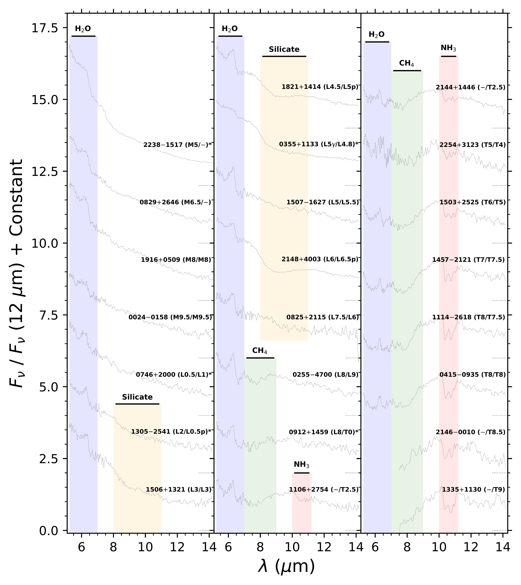
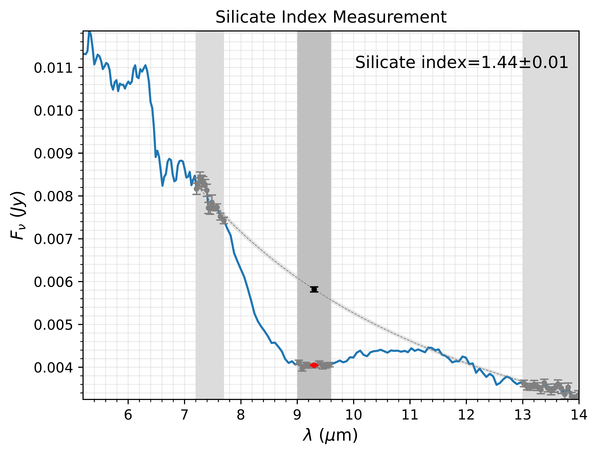
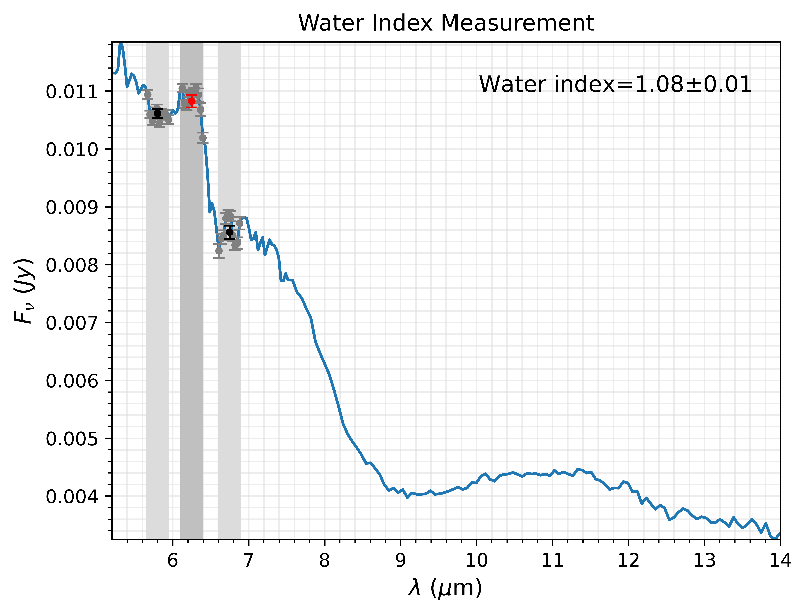
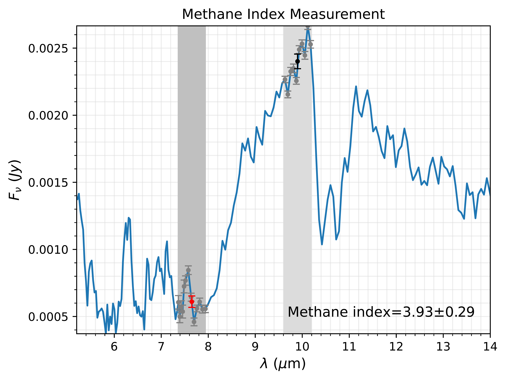
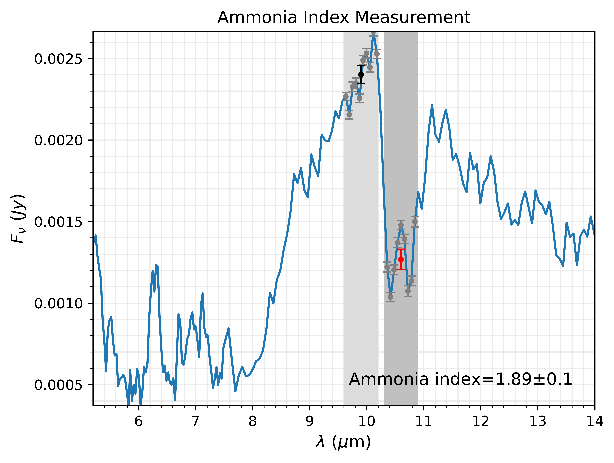

# ``spectral_indices``

## Introduction
``spectral_indices`` is a set of functions to measure the depth of key features in the mid-infrared spectra of brown dwarfs, directly imaged exoplanets, and low-mass stars (see figure below).

Collection of Spitzer IRS mid-infrared spectra in [Suárez & Metchev (2022)](https://ui.adsabs.harvard.edu/abs/2022MNRAS.513.5701S/abstract) highlighting the main features at different spectral types (or temperatures). This repository allows us to measure the strength of the indicated water, methane, amonnia, and silicates features.

[//]: # (This is a comment.)

    

## Overview
``spectral_indices`` includes the following functions to measure spectral indices:
* silicate_index: silicate index for the silicate absorption feature at 9.3 microns as defined in [Suárez & Metchev (2022)](https://ui.adsabs.harvard.edu/abs/2022MNRAS.513.5701S/abstract) and improved in [Suárez & Metchev (2023)](https://ui.adsabs.harvard.edu/abs/2023MNRAS.523.4739S/abstract).
* water_index: water index for the water absorption feature at 6.25 microns as defined in [Cushing et al. (2006](https://ui.adsabs.harvard.edu/abs/2006ApJ...648..614C/abstract) and modified in [Suárez & Metchev (2022)](https://ui.adsabs.harvard.edu/abs/2022MNRAS.513.5701S/abstract).
* methane_index: methane index for the methane absorption feature at 7.65 microns as defined in [Cushing et al. (2006](https://ui.adsabs.harvard.edu/abs/2006ApJ...648..614C/abstract) and modified in [Suárez & Metchev (2022)](https://ui.adsabs.harvard.edu/abs/2022MNRAS.513.5701S/abstract).
* ammonia_index: ammonia index for the ammonia absorption feature at 10.5 microns as defined in [Cushing et al. (2006](https://ui.adsabs.harvard.edu/abs/2006ApJ...648..614C/abstract) and modified in [Suárez & Metchev (2022)](https://ui.adsabs.harvard.edu/abs/2022MNRAS.513.5701S/abstract).

## Tutorial
[This tutorial](https://github.com/suarezgenaro/spectral_indices/blob/main/aux/example_index_measurements.ipynb) explains how to obtain silicate, water, methane, and ammonia indices for mid-infrared spectra of brown dwarfs, as shown below:

    
    
    
    

## Functions
### ``spectral_indices.silicate_index``
	Description:
	------------
		Measure the strength of the mid-infrared silicate absorption considering the defined silicate index in Suárez & Metchev (2022,2023).

	Parameters:
	-----------
	- wl : array
		Spectrum wavelengths in microns.
	- flux : array
		Spectrum fluxes in Jy.
	- eflux : array
		Spectrum flux errors in Jy.
	- silicate_min : float, optional (default 9.3 um)
		Wavelength reference to indicate the center of silicate absorption. 
	- silicate_window : float, optional (default 0.6 um)
		Wavelength window around ``silicate_min`` used to calculate the average flux at the absorption.
	- silicate_cont1 : float, optional (default 7.45 um)
		Wavelength reference to indicate the short-wavelength continuum of silicate absorption. 
	- silicate_window_cont1 : float, optional (default 0.5 um))
		Wavelength window around ``silicate_cont1`` used to calculate the average flux at the short-wavelength absorption continuum.
	- silicate_cont2 : float, optional (default 13.5 um)
		Wavelength reference to indicate the long-wavelength continuum of silicate absorption. 
	- silicate_window_cont2 : float, optional (default 1.0 um)
		Wavelength window around ``silicate_cont2`` used to calculate the average flux at the long-wavelength absorption continuum.
	- default : {``SM23``, ``SM22``}, optional (default ``SM23``)
		Reference to set default parameters to measure the silicate index.
		``SM23`` (default) for Suárez & Metchev (2023) and ``SM22`` for Suárez & Metchev (2022).
	- plot : {``True``, ``False``}, optional (default ``False``)
		Plot (``True``) or do not plot (``False``) the silicate index measurement.
	- plot_title : str, optional
		Plot title (default ``'Silicate Index Measurement'``.
	- plot_xrange : list or array
		Wavelength range (in microns) of the plot (default [5.2, 14] um).
	- plot_yrange : list or array
		Flux range (in Jy) of the plot (default is the flux range in ``plot_xrange``).
	- plot_save : {``True``, ``False``}, optional (default ``False``)
		Save (``'True'``) or do not save (``'False'``) the resulting plot.

	Returns:
	--------
	- Dictionary 
		Dictionary with silicate index parameters:
			- ``'silicate_index'`` : silicate index
			- ``'esilicate_index'`` : silicate index uncertainty
			- ``'flux_silicate_min'`` : flux at the absorption feature
			- ``'eflux_silicate_min'`` : flux error at the absorption feature
			- ``'cont_silicate'`` : flux at the continuum of the absorption
			- ``'econt_silicate'`` : flux uncertainty at the continuum of the absorption
			- ``'slope'`` : slope of the linear fit to the log(flux)-log(wavelength) space
			- ``'eslope'`` : slope uncertainty
			- ``'constant'`` : constant or intercept of the linear fit
			- ``'econstant'`` : constant uncertainty
			- ``'silicate_min'`` : input ``silicate_min``
			- ``'silicate_window'`` : input ``silicate_window``
			- ``'silicate_con1'`` : input ``silicate_con1``
			- ``'silicate_window_con1'`` : input ``silicate_window_con1``
			- ``'silicate_con2'`` : input ``silicate_con2``
			- ``'silicate_window_con2'`` : input ``silicate_window_con2``
			- ``'wl'`` : input ``wl``
			- ``'flux'`` : input ``flux``
			- ``'eflux'`` : input ``eflux``
	- Plot of the silicate index measurement that will be stored if ``plot_save``.

	Author: Genaro Suárez

### ``spectral_indices.water_index``
	Description:
	------------
		Measure the strength of the mid-infrared water absorption considering the defined water index in Cushing et al. (2006) and modified in Suárez & Metchev (2022).

	Parameters:
	-----------
	- wl : array
		Spectrum wavelengths in microns.
	- flux : array
		Spectrum fluxes in Jy.
	- eflux : array
		Spectrum flux errors in Jy.
	- default : {``SM22``, ``C06``}, optional (default ``SM22``)
		Reference to set default parameters to measure the water index.
		``SM22`` (default) for Suárez & Metchev (2022) or ``C08`` for Cushing et al (2006).
	- water_max : float, optional (default 6.25 um)
		Wavelength reference to measure the peak-like feature within the water absorption.
	- water_min1 : float, optional (default 5.80 um)
		Wavelength reference to measure the flux in the first absorption dip.
	- water_min2 : float, optional (default 6.75 um)
		Wavelength reference to measure the flux in the second absorption dip.
	- water_window : float, optional (default 0.3 um)
		Wavelength window around ``water_max``, ``water_min1``, and ``water_min2`` used to calculate the average fluxes.
	- plot : {``True``, ``False``}, optional (default ``False``)
		Plot (``True``) or do not plot (``False``) the water index measurement.
	- plot_title : str, optional
		Plot title (default ``'Water Index Measurement'``.
	- plot_xrange : list or array
		Wavelength range (in microns) of the plot (default [5.2, 14] um).
	- plot_yrange : list or array
		Flux range (in Jy) of the plot (default is the flux range in ``plot_xrange``).
	- plot_save : {``True``, ``False``}, optional (default ``False``)
		Save (``'True'``) or do not save (``'False'``) the resulting plot.

	Returns:
	--------
	- Dictionary 
		Dictionary with water index parameters:
			- ``'water_index'`` : water index
			- ``'ewater_index'`` : water index uncertainty
			- ``'flux_water_max'`` : flux at the absorption peak
			- ``'eflux_water_max'`` : flux uncertainty at the absorption peak
			- ``'flux_water_min1'`` : flux at the short-wavelength absorption dip
			- ``'eflux_water_min1'`` : flux uncertainty at the short-wavelength absorption dip
			- ``'flux_water_min2'`` : flux at the long-wavelength absorption dip
			- ``'eflux_water_min2'`` : flux uncertainty at the long-wavelength absorption dip
			- ``'water_max'`` : input ``water_max``
			- ``'water_min1'`` : input ``water_min1``
			- ``'water_min2'`` : input ``water_min2``
			- ``'water_window'`` : input ``water_window``
	- Plot of the water index measurement that will be stored if ``plot_save``.

	Author: Genaro Suárez

### ``spectral_indices.methane_index``
 	Description:
	------------
		Measure the strength of the mid-infrared methane absorption considering the defined methane index in Cushing et al. (2006) and modified in Suárez & Metchev (2022).

	Parameters:
	-----------
	- wl : array
		Spectrum wavelengths in microns.
	- flux : array
		Spectrum fluxes in Jy.
	- eflux : array
		Spectrum flux errors in Jy.
	- default : {``SM22``, ``C06``}, optional (default ``SM22``)
		Reference to set default parameters to measure the methane index.
		``SM22`` (default) for Suárez & Metchev (2022) or ``C08`` for Cushing et al (2006).
	- methane_in : float, optional (default 7.65 um)
		Wavelength reference within the feature.
	- methane_out : float, optional (default 9.9 um)
		Wavelength reference out of the feature.
		Note: the default value is slightly smaller than the 10 um value in Suárez & Metchev (2022) to avoid including fluxes at the beginning of the ammonia feature.
	- methane_window : float, optional (default 0.6 um)
		Wavelength window around ``methane_in`` and ``methane_out`` used to calculate average fluxes.
	- plot : {``True``, ``False``}, optional (default ``False``)
		Plot (``True``) or do not plot (``False``) the methane index measurement.
	- plot_title : str, optional
		Plot title (default ``'Methane Index Measurement'``.
	- plot_xrange : list or array
		Wavelength range (in microns) of the plot (default [5.2, 14] um).
	- plot_yrange : list or array
		Flux range (in Jy) of the plot (default is the flux range in ``plot_xrange``).
	- plot_save : {``True``, ``False``}, optional (default ``False``)
		Save (``'True'``) or do not save (``'False'``) the resulting plot.

	Returns:
	--------
	- Dictionary 
		Dictionary with methane index parameters:
			- ``'methane_index'`` : methane index
			- ``'emethane_index'`` : methane index uncertainty
			- ``'flux_methane_in'`` : flux within the absorption
			- ``'eflux_methane_in'`` : flux uncertainty within the absorption
			- ``'flux_methane_out'`` : flux out of the absorption
			- ``'eflux_methane_out'`` : flux uncertainty out of the absorption
			- ``'methane_in'`` : input ``methane_in``
			- ``'methane_out'`` : input ``methane_out``
			- ``'methane_window'`` : input ``methane_window``
	- Plot of the methane index measurement that will be stored if ``plot_save``.

	Author: Genaro Suárez

### ``spectral_indices.ammonia_index``
	Description:
	------------
		Measure the strength of the mid-infrared ammonia absorption considering the defined ammonia index in Cushing et al. (2006) and modified in Suárez & Metchev (2022).

	Parameters:
	-----------
	- wl : array
		Spectrum wavelengths in microns.
	- flux : array
		Spectrum fluxes in Jy.
	- eflux : array
		Spectrum flux errors in Jy.
	- default : {``SM22``, ``C06``}, optional (default ``SM22``)
		Reference to set default parameters to measure the ammonia index.
		``SM22`` (default) for Suárez & Metchev (2022) or ``C08`` for Cushing et al (2006).
	- ammonia_in : float, optional (default 10.6 um)
		Wavelength reference within the feature.
		Note: the default value is slightly smaller than the 10.8 um value in Suárez & Metchev (2022) to be centered better within the feature.
	- ammonia_out : float, optional (default 9.9 um)
		Wavelength reference out of the feature.
		Note: the default value is slightly smaller than the 10 um value in Suárez & Metchev (2022) to avoid including fluxes at the beginning of the ammonia feature.
	- ammonia_window : float, optional (default 0.6 um)
		Wavelength window around ``ammonia_in`` and ``ammonia_out`` used to calculate average fluxes.
	- plot : {``True``, ``False``}, optional (default ``False``)
		Plot (``True``) or do not plot (``False``) the ammonia index measurement.
	- plot_title : str, optional
		Plot title (default ``'Ammonia Index Measurement'``.
	- plot_xrange : list or array
		Wavelength range (in microns) of the plot (default [5.2, 14] um).
	- plot_yrange : list or array
		Flux range (in Jy) of the plot (default is the flux range in ``plot_xrange``).
	- plot_save : {``True``, ``False``}, optional (default ``False``)
		Save (``'True'``) or do not save (``'False'``) the resulting plot.

	Returns:
	--------
	- Dictionary 
		Dictionary with ammonia index parameters:
			- ``'ammonia_index'`` : ammonia index
			- ``'eammonia_index'`` : ammonia index uncertainty
			- ``'flux_ammonia_in'`` : flux within the absorption
			- ``'eflux_ammonia_in'`` : flux uncertainty within the absorption
			- ``'flux_ammonia_out'`` : flux out of the absorption
			- ``'eflux_ammonia_out'`` : flux uncertainty out of the absorption
			- ``'ammonia_in'`` : input ``ammonia_in``
			- ``'ammonia_out'`` : input ``ammonia_out``
			- ``'ammonia_window'`` : input ``ammonia_window``
	- Plot of the ammonia index measurement that will be stored if ``plot_save``.

	Author: Genaro Suárez
